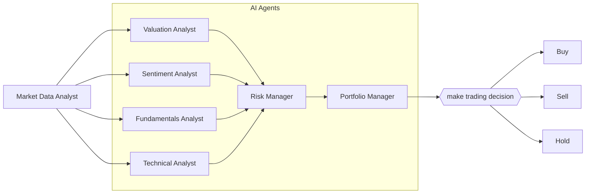
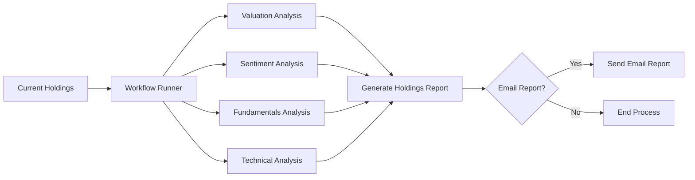

# AI Hedge Fund

This is a proof concept for an AI-powered hedge fund.  The goal of this project is to explore the use of AI to make trading decisions.  This project is for **educational** purposes only and is not intended for real trading or investment.

This system employs several agents working together:

1. Market Data Analyst - Gathers and preprocesses market data
2. Valuation Agent - Calculates the intrinsic value of a stock and generates trading signals
3. Sentiment Agent - Analyzes market sentiment and generates trading signals
4. Fundamentals Agent - Analyzes fundamental data and generates trading signals
5. Technical Analyst - Analyzes technical indicators and generates trading signals
6. Risk Manager - Calculates risk metrics and sets position limits
7. Portfolio Manager - Makes final trading decisions and generates orders
8. Runs - on a set of holdings via `workflow.sh` on a `fund.json` file
9. Can generate reports via `poetry run python src/tools/report.py` and email out via `poetry run python src/tools/report.py --email recipient@example.com`

## AI Hedge Fund

## Holdings Analysis and Report Generation Flow

Note: the system simulates trading decisions, it does not actually trade.

## Disclaimer

This project is for **educational and research purposes only**.

- Not intended for real trading or investment
- No warranties or guarantees provided
- Past performance does not indicate future results
- Creator assumes no liability for financial losses
- Consult a financial advisor for investment decisions

By using this software, you agree to use it solely for learning purposes.

## Table of Contents
- [Setup](#setup)
- [Usage](#usage)
  - [Running the Hedge Fund](#running-the-hedge-fund)
  - [Running the Backtester](#running-the-backtester)
- [Project Structure](#project-structure)
- [Contributing](#contributing)
- [License](#license)

## Setup

Clone the repository:
```bash
git clone https://github.com/YIG-DAO/ai-hedge-fund.git
cd ai-hedge-fund
```

1. Install Poetry (if not already installed):
```bash
curl -sSL https://install.python-poetry.org | python3 -
```

2. Install dependencies:
```bash
poetry install
```

3. Set up your environment variables:
```bash
# Create .env file for your API keys
cp .env.example .env

export OPENAI_API_KEY='your-api-key-here' # Get a key from https://platform.openai.com/
export FINANCIAL_DATASETS_API_KEY='your-api-key-here' # Get a key from https://financialdatasets.ai/
```

## Usage

### Running the Hedge Fund

```bash
poetry run python src/main.py --ticker AAPL
```

You can also specify a `--show-reasoning` flag to print the reasoning of each agent to the console.

```bash
poetry run python src/main.py --ticker AAPL --show-reasoning
```
You can optionally specify the start and end dates to make decisions for a specific time period.

```bash
poetry run python src/main.py --ticker AAPL --start-date 2024-01-01 --end-date 2024-03-01 
```

### Running the Backtester

```bash
poetry run python src/backtester.py --ticker AAPL
```

### Fund Analysis Workflow

The project includes a workflow system for analyzing multiple holdings and generating reports:

1. Run analysis on all fund holdings:
```bash
./workflow.sh
```
This will:
- Process all tickers from fund.json
- Generate fund_state.json with analysis results
- Track successful and failed analyses

2. Generate HTML report:
```bash
poetry run python src/tools/report.py
```
This creates a formatted HTML report in public/fund_report.html

3. Send report via email:
```bash
poetry run python src/tools/report.py --email recipient@example.com
```

#### Email Configuration

To use the email functionality:

1. Update your .env file with email settings:
```
SMTP_SERVER=smtp.gmail.com
SMTP_PORT=587
SMTP_USERNAME=your_email@gmail.com
SMTP_PASSWORD=your_app_specific_password
SENDER_EMAIL=your_email@gmail.com
```

For Gmail:
- Use an App Password instead of your regular password
- Enable 2-factor authentication
- Generate an App Password at: Google Account → Security → 2-Step Verification → App passwords

The HTML report includes:
- Executive summary with analysis metrics
- Holdings grouped by category
- Action signals and confidence levels
- Color-coded indicators for buy/sell signals
- Detailed reasoning for each decision

**Example Output:**
```
Starting backtest...
Date         Ticker Action Quantity    Price         Cash    Stock  Total Value
----------------------------------------------------------------------
2024-01-01   AAPL   buy       519.0   192.53        76.93    519.0    100000.00
2024-01-02   AAPL   hold          0   185.64        76.93    519.0     96424.09
2024-01-03   AAPL   hold          0   184.25        76.93    519.0     95702.68
2024-01-04   AAPL   hold          0   181.91        76.93    519.0     94488.22
2024-01-05   AAPL   hold          0   181.18        76.93    519.0     94109.35
2024-01-08   AAPL   sell        519   185.56     96382.57      0.0     96382.57
2024-01-09   AAPL   buy       520.0   185.14       109.77    520.0     96382.57
```

You can optionally specify the start and end dates to backtest over a specific time period.

```bash
poetry run python src/backtester.py --ticker AAPL --start-date 2024-01-01 --end-date 2024-03-01
```

## Project Structure 
```
ai-hedge-fund/
├── src/
│   ├── agents/                   # Agent definitions and workflow
│   │   ├── fundamentals.py       # Fundamental analysis agent
│   │   ├── market_data.py        # Market data agent
│   │   ├── portfolio_manager.py  # Portfolio management agent
│   │   ├── risk_manager.py       # Risk management agent
│   │   ├── sentiment.py          # Sentiment analysis agent
│   │   ├── state.py              # Agent state
│   │   ├── technicals.py         # Technical analysis agent
│   │   ├── valuation.py          # Valuation analysis agent
│   ├── tools/                    # Agent tools
│   │   ├── api.py                # API tools
│   │   ├── report.py             # Report generation tools
│   │   ├── email.py              # Email sending utilities
│   ├── backtester.py             # Backtesting tools
│   ├── main.py                   # Main entry point
├── public/                       # Generated reports
│   ├── report.html              # Single stock analysis report
│   ├── fund_report.html         # Full fund analysis report
├── fund.json                     # Fund holdings configuration
├── fund_state.json              # Generated fund analysis state
├── workflow.sh                   # Analysis workflow script
├── pyproject.toml               # Project dependencies
├── .env.example                 # Environment variables template
```

## Contributing

1. Fork the repository
2. Create a feature branch
3. Commit your changes
4. Push to the branch
5. Create a Pull Request

## License

This project is licensed under the MIT License - see the LICENSE file for details.
